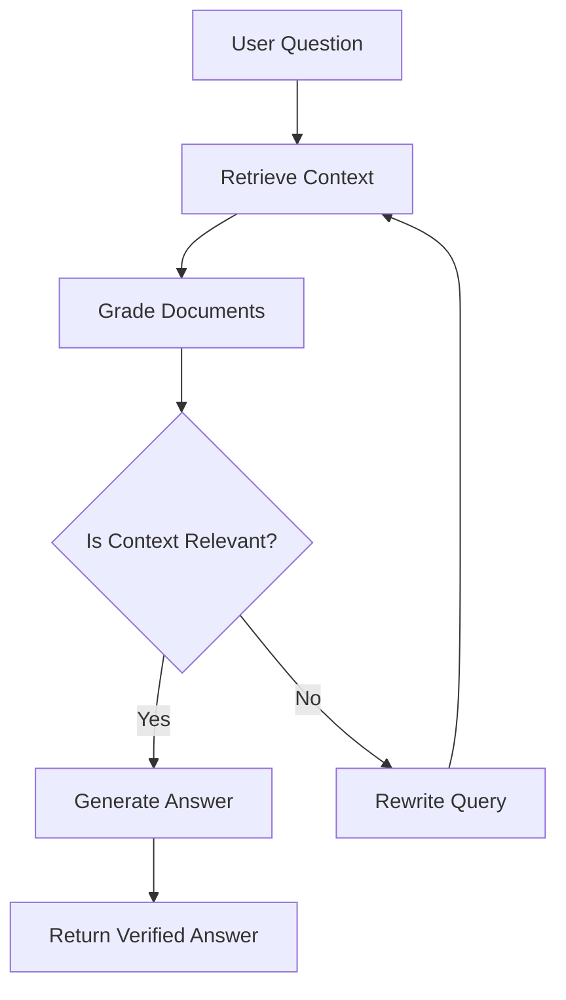

<div align="center">
  <h1>ReForge</h1>
  <p><strong>The Self-Healing RAG Pipeline</strong></p>
  <p>ReForge is an Agentic Retrieval-Augmented Generation (RAG) system that improves retrieval quality through iterative reasoning. It rewrites poor queries when necessary and exposes its reasoning workflow through transparent verification, producing responses that are better grounded in the uploaded documents.</p>

  <!-- Badges -->
  <p>
    
    
    
    
    
  </p>

  <p>
    <!-- [Live Demo](https://example.com) | --> [Documentation](#-documentation-directory) | [Architecture](./docs/04_architecture.md) <!-- | [Demo Video](https://example.com) -->
  </p>

  <!-- Optional Placeholders -->
  <!--  -->
  <!--  -->
</div>

---

## 📖 Project Overview

ReForge is a full-stack AI application that moves beyond naive, linear AI retrieval. Instead of blindly passing the first set of retrieved documents to a Large Language Model, ReForge orchestrates an autonomous, cyclic workflow. It actively critiques its own retrievals, rewrites queries when context is insufficient, and exposes every step of its internal reasoning to the user. This approach vastly improves the grounding of generated responses while transforming the AI from an unpredictable black box into a transparent, verifiable research assistant.

---

## ⚡ Why ReForge?

| Feature | Traditional RAG | ReForge (Agentic RAG) |
| :--- | :--- | :--- |
| **Retrieval Strategy** | Single-pass (Fire and forget) | Iterative (Retrieves until sufficient) |
| **Query Handling** | Uses exact user input | Dynamically rewrites poor queries |
| **Quality Control** | None (Blind generation) | Self-critiques context before answering |
| **Transparency** | Black-box output | Real-time verification logs |
| **Hallucination Mitigation** | Highly susceptible | Designed to improve factual grounding |

---

## 🚀 Demo

> **Note:** Demo assets are currently placeholders.

<!-- [Live Demo](https://reforge-demo.vercel.app) -->
<!--  -->
<!-- [Watch Demo Video](https://youtube.com/watch?v=...) -->

---

## ✨ Key Features

- **Stateful Conversational UI:** Persistent, NextAuth-secured chat threads stored in SQLite.
- **Verification Logs:** Real-time visibility into the LangGraph state machine, displaying exactly what the agent is doing and why.
- **Large Document Processing:** A direct-to-backend upload architecture that safely bypasses serverless payload limits.
- **Semantic Vector Storage:** Automated text extraction, chunking, and localized embedding storage using ChromaDB.
- **Resilient Error Handling:** API limits and backend errors are gracefully intercepted and mapped to clean, user-friendly notifications.

---

## 🏗️ Architecture Preview

ReForge is engineered for long-term maintainability by strictly decoupling its functional domains. It intentionally separates presentation, orchestration, retrieval, and persistence into independently replaceable layers, ensuring the system is highly modular. While standard requests route securely through a Next.js proxy, document uploads connect directly to the FastAPI backend—demonstrating architectural flexibility without compromising security. 

<!--  -->

👉 **Dive deeper:** [Read the full Architecture Document](./docs/04_architecture.md)

---

## 🧠 Self-Healing Pipeline

Unlike standard linear pipelines, ReForge operates as a state machine. It evaluates its own retrieved context and can decide to loop back and try again if the initial data is poor.



---

## 🛠️ Technology Stack

| Layer | Technology |
| :--- | :--- |
| **Frontend** | Next.js (App Router), Tailwind CSS, Framer Motion, NextAuth.js |
| **Backend API** | FastAPI, Python, SQLAlchemy, Uvicorn |
| **AI Orchestration** | LangGraph |
| **Data Storage** | SQLite (Relational), ChromaDB (Vector) |
| **AI Provider** | Gemini API (Embeddings & Generation) |

👉 **Dive deeper:** [Read the Tech Stack & Rationale](./docs/03_tech_stack.md)

---

## 📁 Project Structure

```text
ReForge/
├── backend/            # FastAPI Server & LangGraph Logic
│   ├── app/            # API Routes, Agents, Models, Services
│   └── storage/        # Local DBs (SQLite, ChromaDB)
├── frontend/           # Next.js UI & API Proxies
│   └── src/            # Components, Hooks, Middleware
└── docs/               # Technical Documentation
```

👉 **Dive deeper:** [Read the Folder Structure Document](./docs/05_folder_structure.md)

---

## 🚀 Getting Started

### 1. Prerequisites
- Node.js (v18+)
- Python (v3.10+)
- Google Gemini API Key

### 2. Environment Setup
Copy the example environment files in both directories:
```bash
cp frontend/.env.example frontend/.env.local
cp backend/.env.example backend/.env
```
Fill in the required variables (JWT secrets, API keys, etc.).

### 3. Running the Backend (FastAPI)
```bash
cd backend
python -m venv venv
source venv/bin/activate  # (Windows: venv\Scripts\activate)
pip install -r requirements.txt
uvicorn app.main:app --reload --port 8000
```

### 4. Running the Frontend (Next.js)
```bash
cd frontend
npm install
npm run dev
```
Navigate to `http://localhost:3000`.

---

## 📚 Documentation Directory

We maintain rigorous documentation detailing every aspect of the project's design and implementation.

| Category | Document |
| :--- | :--- |
| **Overview** | [01. Project Overview](./docs/01_project_overview.md) <br> [02. Features](./docs/02_features.md) <br> [12. Design Philosophy](./docs/12_design_philosophy.md) |
| **Architecture** | [03. Technology Stack](./docs/03_tech_stack.md) <br> [04. Architecture](./docs/04_architecture.md) <br> [05. Folder Structure](./docs/05_folder_structure.md) <br> [06. System Design](./docs/06_system_design.md) |
| **Engineering** | [07. API Overview](./docs/07_api_overview.md) <br> [08. Engineering Decisions](./docs/08_engineering_decisions.md) <br> [09. Challenges & Solutions](./docs/09_challenges_and_solutions.md) |
| **Lifecycle** | [10. Future Improvements](./docs/10_future_improvements.md) <br> [11. Testing & Validation](./docs/11_testing_and_validation.md) |

---

## 🗺️ Roadmap

ReForge is under active development. Key upcoming features include migrating to local embedding models (e.g., HuggingFace), implementing semantic chunking, and supporting hybrid search (BM25 + Vector).

👉 **Dive deeper:** [Read the Future Improvements Document](./docs/10_future_improvements.md)

---

## 🤝 Contributing

Contributions are welcome! Please ensure that your PRs maintain the existing architectural separation between the frontend and backend. Before submitting, review our [Design Philosophy](./docs/12_design_philosophy.md) and ensure that all new APIs are securely routed and properly handled for errors.

---

## 📄 License

*A formal license will be added to this repository prior to public release.*
